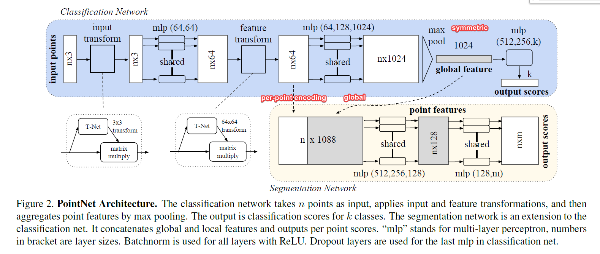
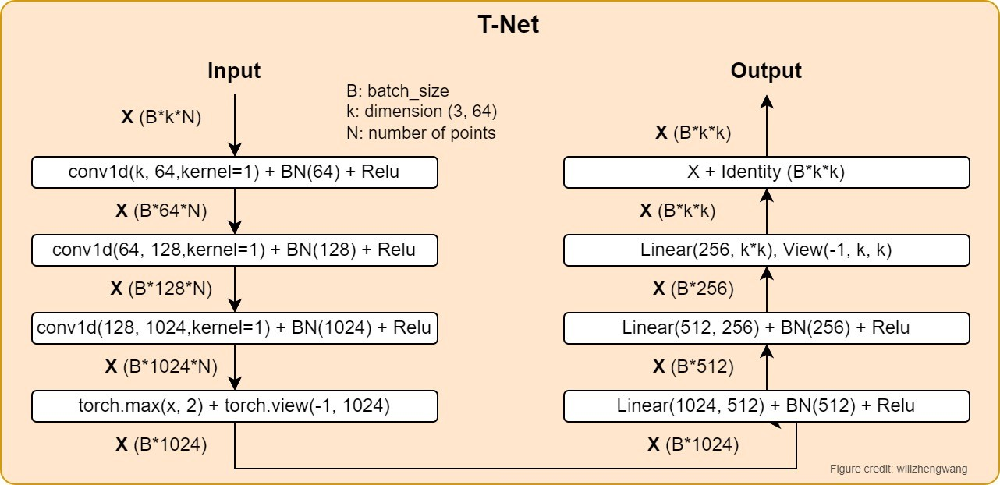
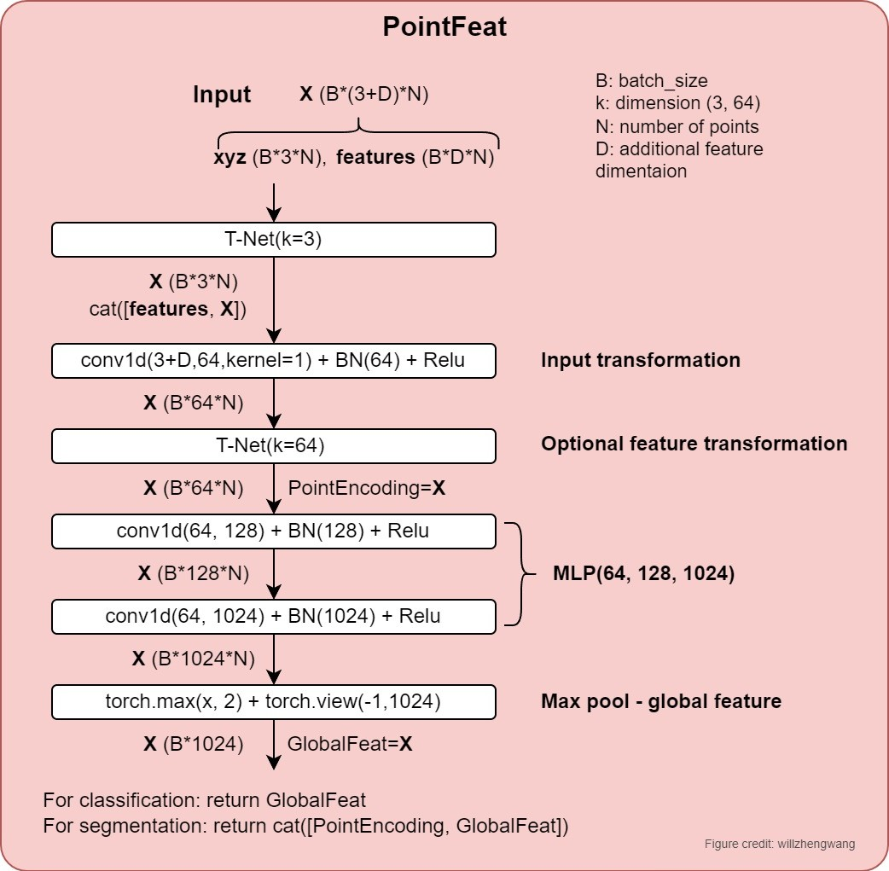
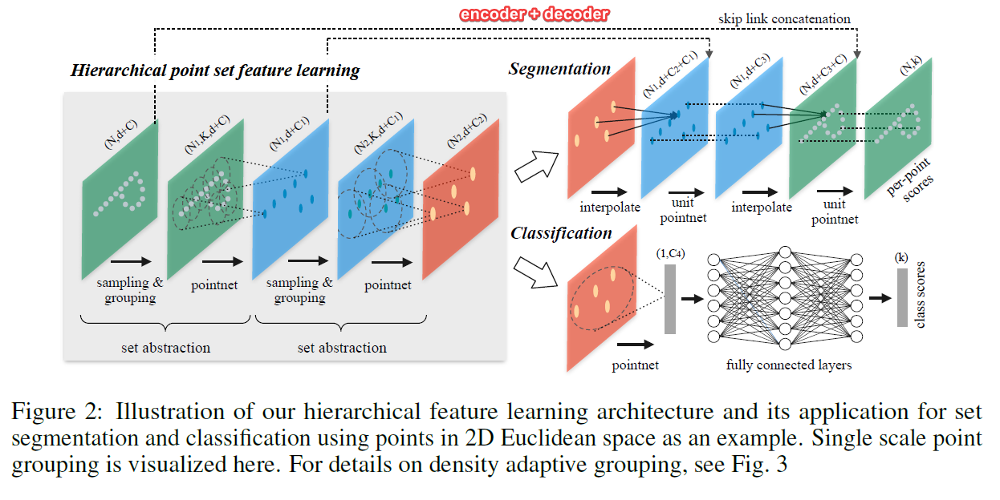

<div align="center">

# PointNet and PointNet++ for Classification and Part Segmentation on Point Clouds

<a href="https://pytorch.org/get-started/locally/"></a>
<a href="https://pytorchlightning.ai/"></a>
<a href="https://hydra.cc/"></a>
<a href="https://github.com/ashleve/lightning-hydra-template"></a><br>

</div>

## Description

I started this project with the aim to learn and understand the key ideas of the two great papers: PointNet and PointNet++. 

This repository is created on top of **[lightning-hydra-template](https://github.com/ashleve/lightning-hydra-template)**, 
which comprises PyTorch Lightning (a lightweight PyTorch wrapper for high-performance AI research) and Hydra (a framework for elegantly configuring complex applications with hierarchical yaml files). 


## Datasets

#### ShapeNet Core Dataset

The ShapeNet Core dataset is a curated subset of the full ShapeNet dataset with single clean 3D models and manually
verified category and alignment annotations.

Download the [ShapeNet Core](https://shapenet.cs.stanford.edu/media/shapenetcore_partanno_segmentation_benchmark_v0_normal.zip) dataset and save it to 'data/shapenetcore_normals' of the project root directory.

This subset contains 16 object categories. It is divided into 6068 training samples, 935 validation samples, and 1437 test samples.
Each point cloud sample includes coordinates with normals and per-pixel labels, enabling classification and part segmentation.


#### Modelnet40 Dataset

The ModelNet40 is a widely used dataset contains synthetic object point clouds for point cloud analysis. 
ModelNet40 has various categories, clean shapes, well-constructed dataset, etc. 
The original ModelNet40 consists of 12,311 CAD-generated meshes in 40 categories (such as airplane, car, plant, lamp), 
of which 9,843 are used for training while the rest 2,468 are reserved for testing. 
The corresponding point cloud data points are uniformly sampled from the mesh surfaces, and then further preprocessed by moving to the origin and scaling into a unit sphere.

Download the [ModelNet40](https://shapenet.cs.stanford.edu/media/modelnet40_normal_resampled.zip) dataset and save it to 'data/modelnet40_normal_resampled' of the project root directory.


## Networks

### PointNet


The architecture of PointNet network is illustrated in the following figure. 
It's actually taken from the PointNet paper [1], and I just added a few notes for interpretation.

<figure>
    
    <figcaption> Pointnet architecture.</figcaption>
</figure>

TNet is a component in the PointNet backbone for input xyz transformation and (optionally) feature transformation. 

<figure>
    
    <figcaption> Architecture of the TNet. </figcaption>
</figure>

PointFeat is another component in the PointNet backbone network for extracting features. The original paper did not name this network, it's just named by myself.

<figure>
    
    <figcaption> Architecture of the PointFeat network. </figcaption>
</figure>

### PointNet++

**Research problems**:

- **PointNet does not capture local structures** induced by the metric space points live in, limiting its ability to recognize fine-grained patterns and generalizability to complex scenes. 
The basic idea of PointNet is to learn a spatial encoding of each point and then aggregate all individual point features to a global point cloud signature.
- Non-uniform point sampling issue: Features learned in dense data may not generalize to sparsely sampled regions. 
Consequently, models trained for sparse point clouds may not recognize fine-grained local structures.

**Solution**

- PointNet++ builds a hierarchical grouping of points and progressively abstracts larger and larger local regions along the hierarchy. 
The set abstraction level comprises three key layers: a **Sampling**, a **Grouping,** and a **PointNet layer**.
    - Sampling method: Farthest point sampling (FPS) is used for sampling. 
    - Grouping: Ball query.

- The hierarchical feature learning in PointNet++ is very similar to CNN in 2D image analysis. 

**Implementation**

There are two versions of the PointNet++ implementation in the repo: Multi-Scale Grouping (MSG) and Multi-Scale Grouping (SSG). 
The files and classes are named with Pointnet2msg or Pointnet2ssg.


<figure>
    
    <figcaption> Architecture of the PointNet++ network. </figcaption>
</figure>

## Installation

I recommend to use `pip` to create a virtual environment for running the code. 
I managed to use both Anaconda and the built-in python pip to create an env, but pip venv seems to be more efficient in solving the env compatibility in this case.  

#### Pip

```bash
# clone project
git clone https://github.com/willzhengwang/pointnet_plus_lightning.git
cd pointnet_plus_lightning

# [OPTIONAL] create a virtual environment with python=3.8 (or after). I created a venv with pycharm IDE.

# Install a certain pytorch version according to instructions
# https://pytorch.org/get-started/

# install requirements
pip install -r requirements.txt
```

(Personal experience: `pip` seems it seems to be easier )

## How to run

Train model with default configuration

```bash
# train on CPU
python src/train.py trainer=cpu

# train on GPU
python src/train.py trainer=gpu
```

You can override any parameter from command line like this

```bash
python src/train.py trainer.max_epochs=20 data.batch_size=16 
```


## Acknowledgements

I would like to express my sincere appreciation to the authors of the following GitHub repositories and YouTube video. 
Your contributions have been invaluable in helping me understand the papers and the implementations.
Thank you for your hard work and commitment to the community.

- Github Repo: [yanx27/Pointnet_Pointnet2_pytorch](https://github.com/yanx27/Pointnet_Pointnet2_pytorch)

- Github Repo: [fxia22/pointnet.pytorch](https://github.com/fxia22/pointnet.pytorch) <br>

- Youtube video: [PointNet++ - Pytorch Implementation and Code Explanation](https://www.youtube.com/watch?v=VupEDNvfwZI) (in Chinese)


## References

[1] Qi, C.R., Su, H., Mo, K. and Guibas, L.J., 2017. 
Pointnet: Deep learning on point sets for 3d classification and segmentation. 
In Proceedings of the IEEE conference on computer vision and pattern recognition (pp. 652-660).

[2] Qi CR, Yi L, Su H, Guibas LJ. 
Pointnet++: Deep hierarchical feature learning on point sets in a metric space. 
Advances in neural information processing systems. 2017;30.

